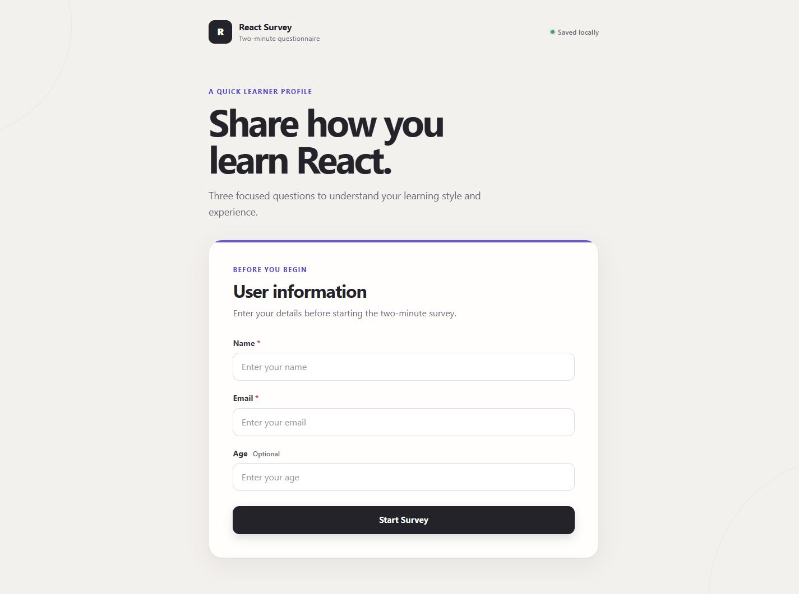
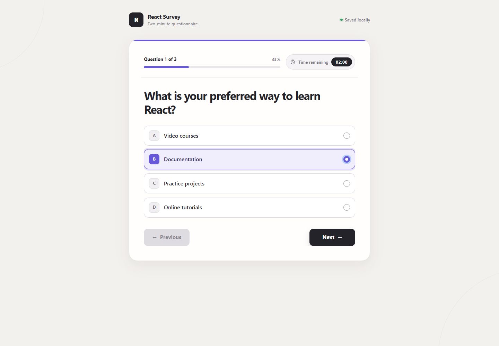
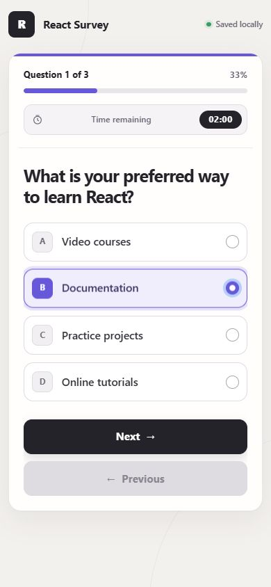

# React Survey

> A polished, accessible multi-step questionnaire with refresh-safe persistence and a real two-minute deadline.

[](https://react.dev/)
[](https://create-react-app.dev/)
[](#testing)
[](https://github.com/mohadesehesmaeilzadeh/react-survey-app/actions/workflows/deploy-pages.yml)

[View live demo](https://mohadesehesmaeilzadeh.github.io/react-survey-app/) · [Browse the source](https://github.com/mohadesehesmaeilzadeh/react-survey-app)



## Overview

React Survey is a frontend-only questionnaire that collects participant details, presents one question at a time, and keeps the entire in-progress session safe across refreshes. The experience includes multiple question types, guarded navigation, a persistent two-minute timer, animated transitions, and dedicated submitted and time-expired completion states.

The project focuses on the details that make a small application feel production-ready: explicit state transitions, resilient browser storage, accessible native controls, responsive interaction design, and focused behavioral tests.

## Features

- One-question-per-page survey flow
- Single-choice, free-text, and multiple-choice questions
- Previous, Next, and Submit navigation with boundary protection
- Answers preserved when moving backward and forward
- Next and Submit disabled until the current answer is valid
- Visible question count and percentage progress
- Two-minute deadline that survives browser refreshes
- Local persistence for user details, answers, progress, deadline, and status
- Safe recovery from malformed or stale `localStorage` values
- Automatic time-expired completion flow
- Duplicate-submission protection
- Completion summary with a safe restart action
- Direction-aware question transitions with reduced-motion support
- Responsive desktop and mobile layouts
- Frontend-only architecture with no backend, authentication, or analytics

## Tech Stack

| Area | Technology |
| --- | --- |
| UI | React 19, React Bootstrap, Bootstrap 5 |
| State | `useReducer`, custom `useSurveyState` hook |
| Motion | Framer Motion |
| Persistence | Browser `localStorage` |
| Testing | Jest, React Testing Library, jest-dom |
| Build | Create React App / `react-scripts` 5 |
| Deployment | GitHub Actions and GitHub Pages |

## Survey Flow

```text
Participant details
        │
        ▼
Start survey ─────────────── starts the two-minute deadline
        │
        ▼
Single choice ──► Free text ──► Multiple choice
        ▲              │               │
        └──── Back ────┴──── Back ─────┘
                                       │
                                       ▼
                              Submit survey
                                       │
                          ┌────────────┴────────────┐
                          ▼                         ▼
                  Completed summary          Time-expired state
                          └────────────┬────────────┘
                                       ▼
                                  Start again
```

Navigation is enforced in both the interface and the reducer. A user cannot skip unanswered questions, move outside the available question range, update an inactive question, or submit before reaching and answering the final question.

## Timer and Persistence

The timer stores an absolute deadline instead of saving a decrementing counter:

```js
const endTime = Date.now() + 2 * 60 * 1000;
const remainingTime = Math.max(endTime - Date.now(), 0);
```

That distinction keeps the timer accurate after refreshes, background tabs, and delayed interval callbacks. Refreshing after 40 seconds resumes near `01:20`; it does not restart at `02:00`.

Only the state required to restore the survey is persisted:

```text
surveyUser
surveyAnswers
surveyCurrentQuestion
surveyEndTime
surveyStatus
```

Stored data is parsed defensively and normalized against the current questions. Invalid answer shapes, unknown statuses, impossible question indexes, invalid users, and stale or suspicious deadlines fall back to a safe reachable state. Timer intervals are cleared on unmount, and each deadline can trigger expiration only once.

## Testing

The focused test suite currently contains **16 passing tests across 3 suites**.

```bash
npm test -- --watchAll=false
```

Coverage focuses on behavior rather than snapshots:

- Question navigation and Back/Next boundaries
- Answer persistence across navigation and refresh
- Required-answer validation for every question type
- Timer restoration, expiration, and interval cleanup
- Completion and duplicate-submit protection
- Restart/reset behavior
- Invalid `localStorage` recovery
- Invalid survey status and question-index recovery

Create React App also runs its configured ESLint rules during the production build:

```bash
npm run build
```

## Accessibility

- Native radio, checkbox, textarea, input, and button controls
- Explicit labels, semantic fieldsets, and labelled question groups
- Logical heading hierarchy and reading order
- Full keyboard navigation with visible focus indicators
- Selected options identified by control state, shape, border, and color
- Accessible progress and timer names
- Disabled navigation exposed with native `disabled` semantics
- Minimum 48px action targets and 56px option rows on mobile
- Completion heading receives focus after submission or expiration
- High-contrast text and interaction states
- `prefers-reduced-motion` support in both Framer Motion and CSS

## Screenshots

### Active question



### Mobile layout

<p align="center">
  
</p>

All screenshots were captured from the running application rather than from a design mockup.

## Installation

### Prerequisites

- Node.js 20 or newer
- npm

### Run locally

```bash
git clone https://github.com/mohadesehesmaeilzadeh/react-survey-app.git
cd react-survey-app
npm ci
npm start
```

Open [http://localhost:3000](http://localhost:3000).

### Production build

```bash
npm run build
```

The optimized static output is generated in `build/`.

## Deployment

This repository is configured for project-site hosting at:

```text
https://mohadesehesmaeilzadeh.github.io/react-survey-app/
```

The `homepage` value in `package.json` makes Create React App generate asset paths beneath `/react-survey-app/`. The Pages workflow then:

1. Checks out `master`
2. Installs exact dependencies with `npm ci`
3. Runs the complete test suite
4. Creates the production build
5. Uploads `build/` as the Pages artifact
6. Deploys through GitHub's official Pages action

The workflow can also be started manually from the repository's **Actions** tab.

## Project Structure

```text
react-survey-app/
├── .github/workflows/deploy-pages.yml
├── docs/screenshots/
├── public/
├── src/
│   ├── components/
│   │   ├── SurveyQuestion.js
│   │   ├── SurveyTimer.js
│   │   ├── SurveyTimer.test.js
│   │   ├── ThankYou.js
│   │   └── UserInfoForm.js
│   ├── data/questions.js
│   ├── hooks/
│   │   ├── useSurveyState.js
│   │   └── useSurveyState.test.js
│   ├── App.css
│   ├── App.js
│   └── App.test.js
├── package.json
└── README.md
```

## Challenges

### Keeping time honest across refreshes

A normal countdown can accidentally grant extra time after a reload or when the browser throttles intervals. Using an absolute deadline makes time calculation independent from render frequency and interval accuracy.

### Restoring state without trusting storage

Browser storage is user-editable and can become stale after application changes. The state initializer validates types, allowed options, statuses, indexes, and deadlines before deciding which question is safely reachable.

### Combining animation with accessibility

Exit animations briefly keep two question panels in the DOM. The departing panel is marked inert, hidden from assistive technology, and unable to receive pointer input. Reduced-motion users receive an immediate transition.

### Preventing invalid state transitions

Disabling a button is useful feedback, but it is not a state guarantee. Reducer actions independently enforce active-question updates, valid navigation, legal completion states, and first/last-question boundaries.

## What I Learned

- Model multi-step UI as explicit state transitions instead of scattered state setters.
- Persist the smallest restorable state and validate everything read from storage.
- Store timer deadlines, not countdown snapshots.
- Keep interval callbacks stable and clean them up on every lifecycle path.
- Treat disabled controls as UX feedback while enforcing the same rule in state logic.
- Make animated transitions non-blocking and remove exiting content from the accessibility tree.
- Prefer focused behavioral tests over brittle snapshots for interactive applications.
- Deployment paths are part of the build configuration when hosting a project beneath a GitHub Pages subdirectory.

## Privacy

Survey data stays in the participant's browser. The project has no backend, account system, analytics integration, or network submission endpoint.

## Author

Built by [mohadesehesmaeilzadeh](https://github.com/mohadesehesmaeilzadeh) as a React portfolio project.
